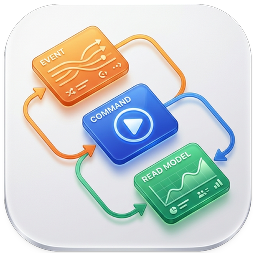

<div align="center">



# Event Modeling

**Map your system as vertical slices of commands, events, constraints, and read models.**

Local-first. Desktop + web. Powered by an AI assistant.

[](https://github.com/0m3kk/event-modeling/actions/workflows/ci.yml)
[](LICENSE)
[](https://v2.tauri.app/)
[](https://react.dev/)
[](https://vite.dev/)
[](#)

Opinionated around **CQRS**, **Event Sourcing**, and **Dynamic Consistency Boundaries (DCB)**.

</div>

---

<!--
## Screenshots

<p align="center">
  
</p>
-->

## ✨ Features

### 🎨 Modeling canvas
- ♾️ Infinite, pannable/zoomable canvas — Pixi.js (GPU) with a spatial index for fast hit-testing
- ✍️ **Write slices**: Command → Constraint(s) → Event(s)
- 📖 **Read slices**: Query → State (optional Constraint layer)
- 🃏 **8 storm card kinds**: command, event, actor, state, constraint, external, query, BDD
- 🧩 **Data model nodes**: object, enum, array, wrapper + 12 primitives (`String`, `Number`, `Boolean`, `UUID`, `DateTime`, `Date`, `Email`, `URL`, `URI`, `JSON`, `Any`, `Void`, plus `[]`)
- 🔒 **DCB + RBAC**: consistency boundaries as query items; `resource:verb:scope` actions with actor wildcards
- 🥒 **BDD cards**: Given/When/Then referencing events, commands, queries, states, errors, externals
- 📐 Groups, connectors, sticky notes, text boxes, reference copies, auto-layout, snapping & guides

### ⚡ Editing experience
- ↩️ Undo/redo — 500-step history, one AI turn collapses into a single step
- 🔦 Marquee select, resize handles, inline text editing, rich popovers for tags/actions/validation
- 🔍 Search across cards, fields, tags, and rules (`Cmd/Ctrl+F`)
- 🌗 Light/dark themes · 🌐 English & Vietnamese

### 🤖 AI assistant
- 🔌 OpenAI-compatible (OpenAI, Ollama, LM Studio, …)
- 🛠️ Tool-calling agent — 25 canvas/storm/model tools, with JSON-plan fallback
- 🗜️ Auto-compaction for long conversations

### 💾 Files & export
- 📄 `.storm` / `.json` project files (versioned, validated)
- 🧾 **JSON Schema** export (draft-07 & 2020-12)
- 🖼️ **Image export** — PNG at multiple resolutions + vector SVG
- 💽 Auto-save to `localStorage` with one-slot backup & restore
- ☁️ **Google Drive** open/save/export (PKCE OAuth; loopback on desktop)

## 🖥️ Desktop & web

One React/Pixi codebase, two targets. Platform is detected at runtime (`src/utils/platform.ts`), so the UI adapts automatically.

| | 🌐 Web app | 🖥️ Desktop app |
| --- | --- | --- |
| **Stack** | Vite SPA | Tauri 2 native shell |
| **Platforms** | Anywhere you can host it | macOS · Windows · Linux |
| **Menus** | In-app File / Export | Native OS menu bar (File / Edit / View / Export / Window) |
| **Files** | Browser download/upload | Native open/save dialogs |
| **Sign-in** | Google Identity Services popup | System browser + loopback OAuth |

## 🧱 Tech stack

| Layer | Stack |
| --- | --- |
| **Frontend** | React 19 · TypeScript · Vite · Tailwind CSS 4 |
| **Canvas** | Pixi.js 8 · pixi-viewport · rbush |
| **State** | Zustand · zundo (undo/redo) · Zod |
| **i18n** | i18next · react-i18next |
| **Desktop** | Tauri 2 (Rust) · http, opener, OAuth plugins |
| **Tooling** | pnpm · Vitest · ESLint · Prettier |

## 🚀 Getting started

**Prerequisites**

- Node.js **22+** and pnpm **12+**
- Desktop build only: a [Rust toolchain](https://www.rust-lang.org/tools/install) and [Tauri system dependencies](https://v2.tauri.app/start/prerequisites/)

```bash
pnpm install     # install

pnpm dev         # run the web app
pnpm tauri dev   # run the desktop app

pnpm build       # type-check + build web bundle → dist/
pnpm tauri build # produce a native desktop bundle
```

## 🔌 Google Drive setup (optional)

Copy `.env.example` to `.env.local` and fill in what you need:

| Variable | Purpose |
| --- | --- |
| `VITE_GOOGLE_CLIENT_ID` | OAuth "Web application" client for the browser build |
| `VITE_GOOGLE_DESKTOP_CLIENT_ID` | OAuth "Desktop app" client for Tauri (loopback redirect) |
| `VITE_GOOGLE_DESKTOP_CLIENT_SECRET` | Optional; only if your client requires a secret on token exchange |
| `VITE_GOOGLE_ACCESS_TOKEN` | Optional; direct token for local development/testing |

> [!IMPORTANT]
> The desktop app signs in via the system browser with a loopback redirect (`http://127.0.0.1:<port>`), so it needs a **Desktop app** OAuth client — a Web application client won't work there.

## 📜 Scripts

| Command | Description |
| --- | --- |
| `pnpm dev` | Start the Vite dev server |
| `pnpm build` | Type-check and build the web bundle |
| `pnpm preview` | Preview the production build |
| `pnpm test` | Run the test suite once |
| `pnpm test:watch` | Run tests in watch mode |
| `pnpm typecheck` | Type-check without emitting |
| `pnpm lint` | Run ESLint |
| `pnpm tauri` | Tauri CLI (e.g. `pnpm tauri dev`) |
| `pnpm bump` | Bump version + release (`:patch`, `:minor`, `:major`) |

## 📁 Project structure

```
src/
  ai/           AI assistant: client, agent loop, prompt, tools
  components/   React UI (header, toolbar, canvas, modals, popovers)
  constants/    Canvas/storm/model/menu constants
  engine/       Pixi.js canvas engine, layers, renderers, spatial index
  hooks/        useAutoSave, useTheme, useResizablePanel
  i18n/         i18next setup and locales (en, vi)
  store/        Zustand store, types, history debounce/batching
  types/        Domain type definitions
  utils/        Pure logic: geometry, routing, export, file IO, Google Drive
src-tauri/      Rust/Tauri shell: native menu, plugins, config
```

## 📦 Releases

`scripts/bump-version.sh` bumps `package.json` + `src-tauri/tauri.conf.json`, commits, tags, pushes, and opens a GitHub release. Publishing triggers the **Release** workflow → builds a macOS (ARM64) bundle and uploads the DMG. CI runs lint, type-check, tests, and the web build on every push and PR.

## 📄 License

[MIT](LICENSE) © 0m3kk
